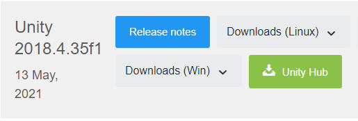
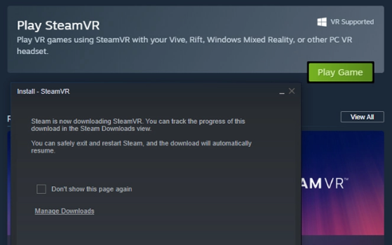
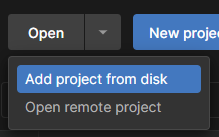
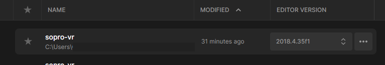
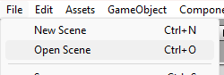
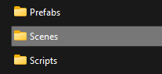
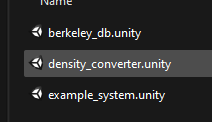
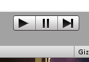

# VRCode

Initially created during the thesis of Leon H. in 2018/19 (Bauhaus University Weimar).
Extended during the thesis of Quoc Duong B. in 2021/22 (Leipzig University).

This virtual reality framework should support developers in detecting and understanding energy- and performance bugs of configurable software systems. It reduces utilization of the working memory by visualizes energy- and performance-influence models, feature models, and data- and control flow information in on tool. This reduces the number of necessary context switches between the information sources that are necessary for bug detection. Further, by utilizing the space and position of objects developers can interact with the software system more naturally in the three-dimensional way.

The following sections will provide an overview of the repository contents,
including links to installation instructions and more.

## Features

### Code analysis tools


### Laser and gesture control


### Software component analysis with Code City 


## Getting Started

### 1. Download and install Unity 2018.4.35f1
Download link: https://unity3d.com/get-unity/download/archive). We recommend to use the Unity Hub in order to manage multiple Unity versions (https://unity3d.com/get-unity/download



### 2. Set up Steam VR.

Download and install Steam VR through Steam. Start it afterwards:



Make sure to connect your VR Headset and your controllers.

### 3. Clone this repository.
```
git clone git@github.com:vanHekthor/VRCode.git
```

### 4. Open the Unity project

Add this repository as a project (using the Unity Hub).



Afterwards, open the project using Unity version 2018.4.35f1.



### 5. Select a scene

Open a scene in the Unity Editor using File -> Open Scene.



Select the scenes-folder and choose a scene.




### 6. Start the scene



# Instructions

## General

- [Introduction Slides - Sept. 2019 (PDF)](Documentation/slides/introduction_sept-2019.pdf)
- [Current Features - Sept. 2019 (PDF)](Documentation/instructions/03_current-features.pdf)
- [Installation (overview)](Documentation/framework-setup.md)
- [Installation (detailed - with figures) (PDF)](Documentation/instructions/01_installation.pdf)
- [Getting Started (PDF)](Documentation/instructions/02_getting-started.pdf)

## Project Setup

This section lists instructions and descriptions that are required if you want
to load in your own software project and visualize it with this software.  

- [Workspace (overview)](Documentation/workspace.md)
- [Application Configuration ("app_config.json")](Documentation/file-specs/app_config.md)
- [Edge Definition ("edges_*.json")](Documentation/file-specs/edges.md)
- [Region Definition ("regions_*.json")](Documentation/file-specs/regions.md)
- [Feature Model Definition (variability_model.xml)](Documentation/file-specs/feature-model.md)
- [Value Mappings (mappings_*.json)](Documentation/file-specs/value-mapping.md)

## Additional

This section lists additional content like explanations about how some visualizations are implemented.

- [Changelogs](Documentation/changelog/changelog.md)
- [ToDo List](Documentation/changelog/todo.md)
- [Example Images](Documentation/example-imgs/)
- [Cone Tree Base (PDF)](Documentation/cone-tree/cone-tree.pdf)
- [Cone Tree Examples (images)](Documentation/cone-tree/examples)


# Tools

The following tools will help you to perform e.g. syntax highlighting on your project source code.  

- [Syntax Highlighter](Tools/code_to_rt/) - to show syntax highlighting in Unity
- [NFP Convertion Tool](Tools/nfp_conversion/) - to convert measurement data to the regions format
