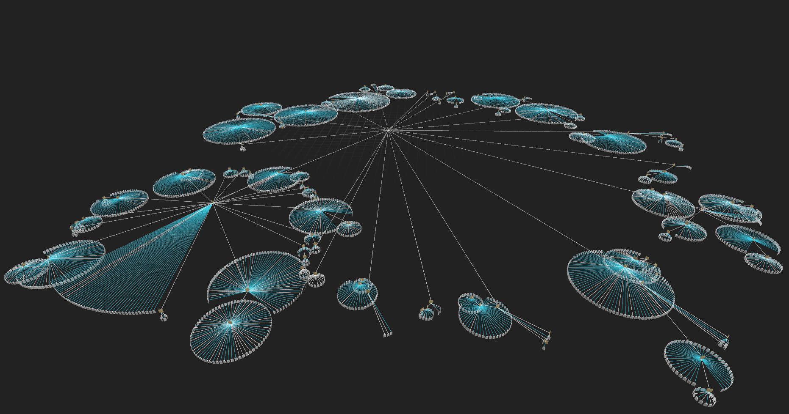
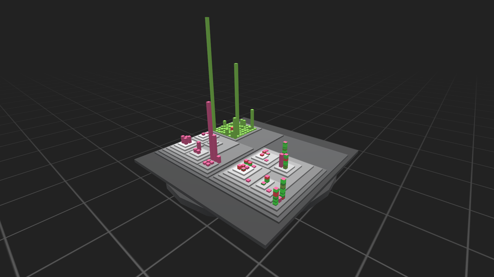
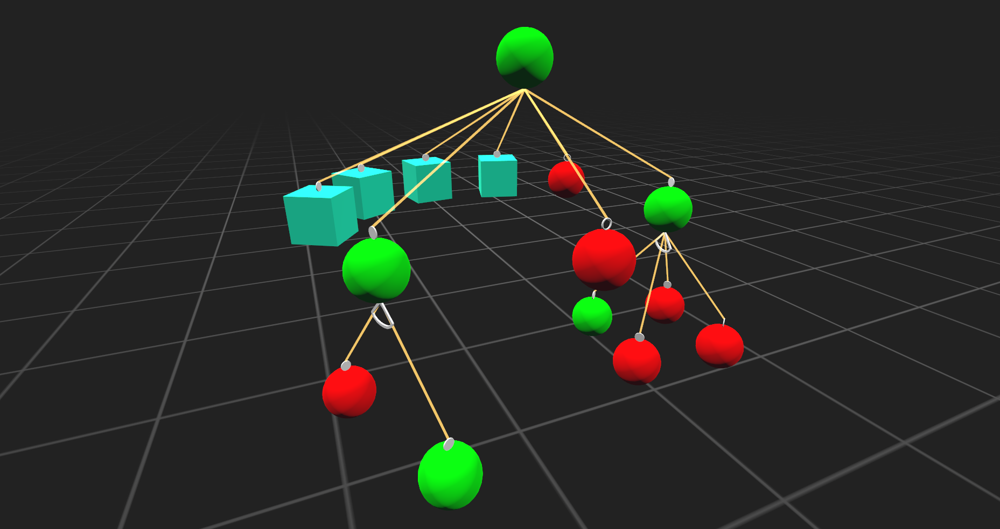
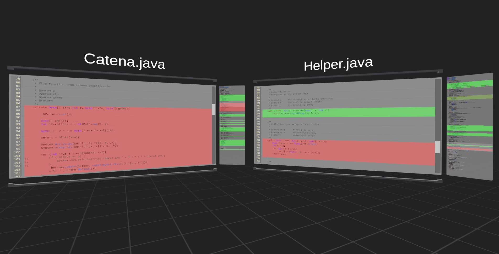

# VR-VIS Framework

Created during the thesis of Leon H. in 2018/19.  

A virtual reality framework to explore and analyze software systems  
using available performance, feature model, and control flow data.  
Please refer to the publication for more detailed information.  

The following sections will provide an overview of the repository contents,
including links to installation instructions and more.  

# Instructions

## General

- [Installation (overview)](Documentation/framework-setup.md)
- [Installation (detailed - with figures) (PDF)](Documentation/instructions/01_installation.pdf)
- [Getting Started (PDF)](Documentation/instructions/02_getting-started.pdf)
- [Current Features (PDF)](Documentation/instructions/03_current-features.pdf)

## Project Setup

This section lists instructions and descriptions that are required if you want
to load in your own software project and visualize it with this software.  

- [Workspace (overview)](Documentation/workspace.md)
- [Application Configuration ("app_config.json")](Documentation/file-specs/app_config.md)
- [Edge Definition ("edges_*.json")](Documentation/file-specs/edges.md)
- [Region Definition ("regions_*.json")](Documentation/file-specs/regions.md)
- [Feature Model Definition (variability_model.xml)](Documentation/file-specs/feature-model.md)
- [Value Mappings (mappings_*.json)](Documentation/file-specs/value-mapping.md)

## Additional

This section lists additional content like explanations about how some visualizations are implemented.

- [Example Images](Documentation/example-imgs/)
- [Cone Tree Base (PDF)](Documentation/cone-tree/cone-tree.pdf)
- [Cone Tree Examples (images)](Documentation/cone-tree/examples)
- [Changelogs](Documentation/changelog/changelog.md)
- [ToDo List](Documentation/changelog/todo.md)

 

